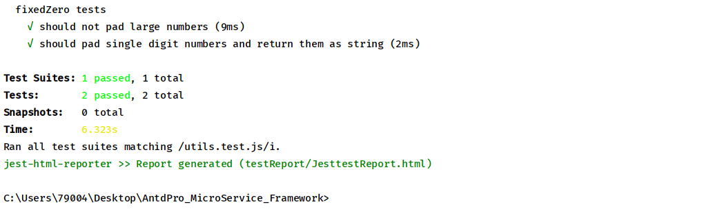
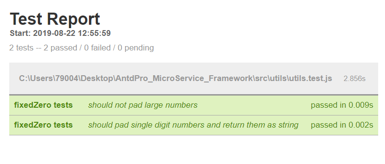

### 前端单元测试自动化报告
+ 在开发React应用或者其他Web应用时，我们经常要进行函数单元测试,来确保函数的功能准确性
+ jest是facebook开发的单元测试框架，但是他的测试结果通常是在终端或者cmd里面显示.
+ 其形式不够美观，而且无法一目了然的看到测试结果。

#### 准备工作
+ 确保你的项目已经安装了版本较新的jest测试框架(随版本更迭有可能产生无法预知的BUG，如：配置属性名变更)，安装jest：cnpm install --save-dev jest
+ 已经完成了对jest配置文件jest.config.js的基本配置

#### 参数配置
+ 根据jest官方文档在jest.config.js中有testResultsProcessor属性：

| Property |  Description  | Type | Default|
|-------|:---:|:---:|------|
| testResultsProcessor | This option allows the use of a custom results processor. This processor must be a node module that  exports a function expecting an object with the following structure as the first argument and return it: | string | undefined |

这个属性可以允许结果处理程序使用。这个处理器必须是一个输出函数的node模块，这个函数的第一个参数会接收测试结果，且必须在最终返回测试结果。可以用与于接收测试结果，且在最终返回测试结果

#### 实现在浏览器上实现测试结果的显示
##### 方法
+ 1.我们可以通过nodejs实现但是需要配置一个简单的node服务器，来实现在浏览器显示。但是方法过于繁琐，不在赘述。
+ 2.我们借助于报告工具jest-html-report(本质与第一个方法没有区别，只是这个工具是打包好的，可以直接使用)

首先我们安装它：cnpm install jest-html-report  --save-dev 

在jest.config.js中，具体配置jest-html-reporter的属性

用到的属性：

| Property |  Description  | Type | Default|
| :-----| :----: | :----: | :----: |
| pageTitle | The title of the document | string | "Test Suite"|
| outputPath | The path to where the plugin will output the HTML report | string |"./test-report.html" |
| includeFailureMsg | If this setting is set to true, this will output the detailed failure message for each failed test. | boolean | false |
其他属性参考官方文档：https://github.com/Hargne/jest-html-reporter/wiki/configuration

jest.config.js配置：
<pre>
    <code>
       //jest.config.js
       module.exports={
           ...
           testResultsProcessor:'./testReport',
           reporters: [
           'default',
           [
             './node_modules/jest-html-reporter',
             {
               pageTitle: 'Test Report',
               outputPath: 'testReport/JesttestReport.html',
               includeFailureMsg: true,
             },
           ],
         ],
       }
    </code>
</pre>

#### 实现单元测试
##### 测试用例
以下是一个完整的测试用例
+ 创建js文件，描述测试函数

<pre>
  <code>
//utils.js
export function fixedZero(val) {
  return val * 1 < 10 ? `0${val}` : val;
}
  </code>
</pre>

+ 创建.test.js文件,添加断言

<pre>
  <code>
//utils.test.js
import { fixedZero } from './utils';
...
// describe('函数分组测试描述',() => {
//   test('测试描述', () => {
//       expect("").toBe("");
//   });    
// })

describe('fixedZero tests', () => {
  it('should not pad large numbers', () => {
    expect(fixedZero(10)).toEqual(10);
    expect(fixedZero(11)).toEqual(11);
    expect(fixedZero(15)).toEqual(15);
    expect(fixedZero(20)).toEqual(20);
    expect(fixedZero(100)).toEqual(100);
    expect(fixedZero(1000)).toEqual(1000);
    expect(fixedZero(1000)).toEqual(1000);
  });

  it('should pad single digit numbers and return them as string', () => {
    expect(fixedZero(0)).toEqual('00');
    expect(fixedZero(1)).toEqual('01');
    expect(fixedZero(2)).toEqual('02');
    expect(fixedZero(3)).toEqual('03');
    expect(fixedZero(4)).toEqual('04');
    expect(fixedZero(5)).toEqual('05');
    expect(fixedZero(6)).toEqual('06');
    expect(fixedZero(7)).toEqual('07');
    expect(fixedZero(8)).toEqual('08');
    expect(fixedZero(9)).toEqual('09');
  });
});
  </code>
</pre>

在命令行输入npm test utils.test.js，我们可以看到命令台的返回

测试结果被成功返回在testReport/JesttestReport.html我们打开这个html文件

#### 总结
+ 优点：实现了前端单元测试自动化生成报告
+ 缺点：每次重新测试无法刷新测试结果，必须手动重新打开结果html网页

#### 文档
+ jest官方文档：https://jestjs.io/docs/en/getting-started.html
+ jest-html-reporter官方文档：https://github.com/Hargne/jest-html-reporter/wiki/configuration
