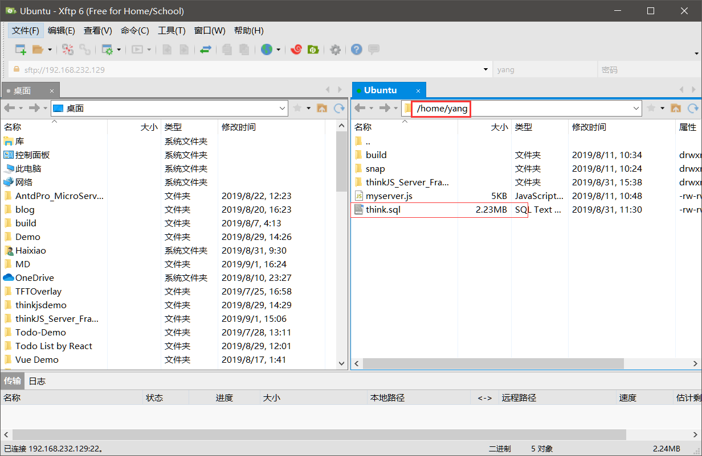

### Ubuntu 18.04 下安装MySQL Server
+ MySQL是一个免费且广泛使用的开源关系数据库。如果您知道自己需要数据库但对所有可用选项知之甚少，那么这是一个不错的选择。

#### 安装MySQL
<pre>
<code>
    sudo apt-get update
    sudo apt-get install mysql-server
</code>
</pre>

#### 启动MySQL服务
+ 安装完成后，您可以通过运行以下命令来启动数据库服务。如果该服务已启动，则会显示一条消息，通知您该服务已在运行：
<pre>
<code>
    systemctl start mysql
</code>
</pre>

#### 重启时启动
+ 要确保在重新引导后启动数据库服务器，请运行以下命令：
<pre>
<code>
    systemctl enable mysql
</code>
</pre>

#### 跨权使用mysql
<pre>
<code>
    sudo mysql(用于忘记root密码时配置MySQL)
</code>
</pre>

#### 添加数据库用户
当应用程序使用root用户连接到数据库时，它们通常具有超出所需权限的权限。您可以添加应用程序可用于连接到新数据库的用户。

+ 添加新的用户:
<pre>
<code>
    这里以user：yang,password:yang 为例
</code>
</pre>
+ 允许本地IP访问localhost的MySQL数据库
<pre>
<code>
    use mysql;
    select host,user from user;
    +-----------+------------------+
    | host      | user             |
    +-----------+------------------+
    | localhost | debian-sys-maint |
    | localhost | mysql.session    |
    | localhost | mysql.sys        |
    | localhost | root             |
    +-----------+------------------+
    mysql> create user 'yang'@'localhost' identified by 'yang';
    select host,user from user;
    +-----------+------------------+
    | host      | user             |
    +-----------+------------------+
    | localhost | debian-sys-maint |
    | localhost | mysql.session    |
    | localhost | mysql.sys        |
    | localhost | root             |
    | localhost | yang             |
    +-----------+------------------+
</code>
</pre>
+ 允许外网IP访问数据库,所有的IP都可以访问该数据库
<pre>
<code>
    mysql> create user 'yang'@'%' identified by 'yang';
</code>
</pre>
+ 创建完成后，刷新
<pre>
<code>
    mysql> flush privileges;
</code>
</pre>

#### 用户授权
+ 更改用户赋权，并刷新授权
<pre>
<code>
    mysql> GRANT ALL PRIVILEGES ON *.* TO 'yang'@'%' IDENTIFIED BY 'yang' WITH GRANT OPTION;
    mysql> flush privileges;
</code>
</pre>

#### 开启外网访问权限
+ 开启MySQL远程访问
<pre>
<code>
    sudo ufw allow mysql
</code>
</pre>
+ 查看3306端口是否对外开放
<pre>
<code>
    netstat -an | grep 3306
    tcp    0   0 127.0.0.1:3306      0.0.0.0:*         LISTEN
</code>
</pre>
如果显示如上，说明mysql端口目前只监听本地连接127.0.0.1。然后需要修改mysql的配置文件
<pre>
<code>
    cd /etc/mysql/mysql.conf.d
    sudo vim mysqld.cnf
</code>
</pre>
找到bind-address = 127.0.0.1将其注释掉
<pre>
<code>
    a 插入模式，注释#
    Esc 
    ：wq保存退出
</code>
</pre>
<pre>
<code>
    重启mysql
    service mysql restart
</code>
</pre>

#### 数据库操作
+ 数据库操作
<pre>
<code>
    创建数据库
    create database dbname charset=utf8;
    删除数据库
    drop database dbname;
    切换数据库
    use dbname;
    查看当前选择的数据库
    select database();
    
    注.　以上dbname 为数据库名称
</code>
</pre>
+ 表操作
<pre>
<code>
    查看当前数据库所有表
    show tables;
    创建表
    create table tablename();
    修改表
    alter table tablename add|change|drop 列名　类型；
    删除表
    drop table tablename;
    查看表结构
    desc tablename;
    查询
    select * from tablename;
    增加
    全列插入: insert into tablename values(....);
    缺省插入: insert into tablename(列１....) values(值1 .....);
    同时插入多条数据　insert into tablename values(....),(.....);
    或　insert into tablename(列１...) values(值１...),(值１....);
    修改
    update tablename set 列1=值1 ,... where 条件;
    删除
    delete from tablename where 条件;
</code>
</pre> 
+ 导入sql脚本文件
<pre>
<code>
    进入mysql shell
    mysql -u root -p
    Entry password:
</code>
</pre>
<pre>
<code>
    首先使用 xftp6 传输你的dbname.sql文件到虚拟机
</code>
</pre>

mysql shell下执行以下命令
<pre>
<code>
    创建数据库
    create database think charset=utf8;
    选择数据库
    use think;
    导入sql
    source /path/path/think.sql;
    
    注： 以数据库think,SQL脚本think.sql为例
</code>
</pre>
