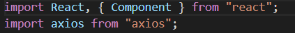

### React-请求数据并渲染数据

+ axios
+ ajax
+ fetch

### axios

#### 安装axios，这里使用的cnpm
<pre>
    npm isntall axios --save
</pre>

#### 在react-app中，引用axios
<pre>
    import axios from "axios";
</pre>

#### 简单使用
<pre>
    getDate() {
        const _this = this;
        axios
          .get("url")
          .then(res => {
            _this.setState({ data: res.data });
          });
    }
    
    componentDidMount() {
        this.getDate();
    }
</pre>

#### 一个例子
<pre>
    test.json
    
    [
      {
        "id": "1",
        "name": "小红",
        "age": 20,
        "sex": "女"
      },
      {
        "id": "2",
        "name": "小明",
        "age": 21,
        "sex": "男"
      },
      {
        "id": "3",
        "name": "翠花",
        "age": 24,
        "sex": "女"
      },
      {
        "id": "4",
        "name": "秋香",
        "age": 25,
        "sex": "女"
      },
      {
        "id": "5",
        "name": "张三",
        "age": 30,
        "sex": "男"
      }
    ]
</pre>
<pre>
    将最开始创建的test.json放到react-app的public下
    注：若是引用网络数据，直接使用绝对地址。
    
    getDate() {
        axios
          .get(
            "./test.json"
          )
          .then(res => {
            this.setState({ data: res.data });
          });
    }
    
    componentDidMount() {
        this.getDate();
    }
</pre>

### ajax

#### 安装jquery，这里使用的cnpm ，引用 $
<pre>
    npm isntall jquery --save
    
    import $ from 'jquery';
</pre>

#### 简单使用
<pre>
    componentDidMount() {
            this.listRender();
    }
    
    listRender = e => {
        $.ajax({
            type: "POST",
            url: "http://127.0.0.1:8360/goods/index",
            dataType: "json",
        }).then(res => {
        this.setState({
                list: res.data.data,
            });
        });
    }
</pre>

### fetch
<pre>
    getDate() {
        fetch("../aboutdata.json", {
          method: "GET"
        })
          .then(res => res.json())
          .then(data => {
            this.setState({ aboutdata: data });
          });
    }
    
    componentDidMount() {
        this.getDate();
    }
</pre>
