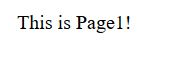

## Router页面跳转简单例子

在一张页面中，我们该如何去实现页面跳转呢
+ Router提供了页面跳转渲染的方法，React应用会根据链接地址去决定要渲染的内容
+ 链接地址不再是直接跳转，而是去告诉React，我需要怎么样的内容，让React去条件渲染

### 准备工作
##### 首先，我们快速创建一个React-app。 删去src目录下的所有文件，重写

        index.js
        
        import React from 'react';
        import ReactDOM from 'react-dom';
        import App from './App';
        ReactDOM.render(<App/>, document.getElementById('root'));
        App.js
        
        import React from 'react';
        import {Router} from 'react-router-dom';
        import Home from './Home';
        import Page1 from './Page1';
        import Page2 from './Page2';
        import Page3 from './Page3';
        
        class App extends React.Component {
        render(){
        return(
        <Router >
        

        <Route path="/" component={Home} />
        <Route path="/Page1" component={Page1} />
        <Route path="/Page2" component={Page2} />
        <Route path="/Page3" component={Page3} />
        

        </Router>
        )
        }
        }
        export default App;

依次创建引入的组件：Home、Page1、Page2、Page3；同时引入Link进行页面跳转
<pre>
        import React from 'react';
        import { Link } from 'react-router-dom';
        
        class Home extends React.Component{
        render(){
        return(
        

        
This is Home!

        

        <Link to="/Page1/" style={{color:'black'}}>
        
点击跳转到Page1

        </Link>
        <Link to="/Page2/" style={{color:'black'}}>
        
点击跳转到Page2

        </Link>
        <Link to="/Page3/" style={{color:'black'}}>
        
点击跳转到Page3

        </Link>
        

        

        );
        }
        }
        
        //Page1~Page3页面类似，不再赘述
        export default Home;
        
        import React from 'react';
        
        class Page1 extends React.Component{
        render(){
        return(
        

        
This is Page1!

        

        );
        }
        }
        
        export default Page1;

##### 可以通过exact属性来选择渲染时不默认渲染这个页面
        <Route exact path="/" component={Home} />
        //此时，当在跳转到/Page1时，即使包含了path="/",也不会渲染component={Home}的组件

<pre>
    eg:
    当点击"点击跳转到Page1"时，页面会选择渲染pathname="/Page1"的component
</pre>
page

!

route

