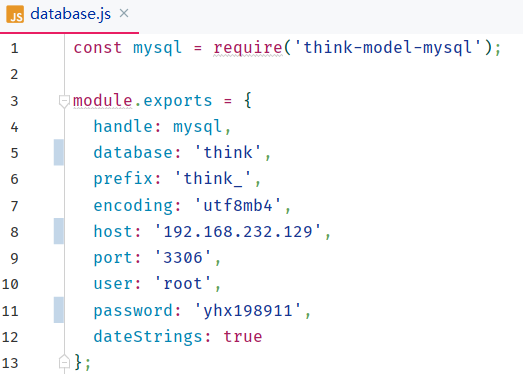

## Think.js数据库配置
<pre>
    在Thinkjs项目中进行配置src/config/database.js文件
</pre>
<pre>
    module.exports = {
      handle: mysql,
      database: 'think', // database_name
      prefix: 'think_', // database_table 前缀
      encoding: 'utf8mb4',
      host: '192.168.232.129', // MySQLip地址
      port: '3306', // MySQL端口号
      user: 'root', // MySQL用户名
      password: 'yhx198911', // MySQL用户密码
      dateStrings: true
    };
</pre>
示例：

