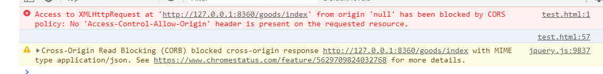

### 场景
+ 学习Thinkjs3.0,但是前后台分离,产生了跨域问题
#### 问题描述

+ koa2 的跨域问题可以通过引入koa-cors2来解决
#### 解决步骤:
+ 1.安装kcors
<pre>
    npm install kcors –save 
    官方文档https://www.npmjs.com/package/koa-cors
</pre>
+ 2.在middleware.js中引入kcors中间件
<pre>
    const kcors = require('kcors'); // 引入kcors中间件
</pre>
<pre>
    module.exports = [
    ...
      {
        handle: kcors, // 处理跨域
        options: {}
      },
    ...
    }
</pre>
